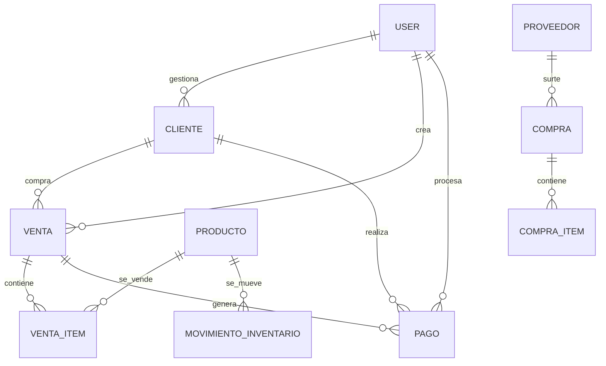

# 🗄️ ESQUEMA COMPLETO DE BASE DE DATOS - Sistema ERP

## 📊 RESUMEN DE TABLAS

### ✅ COMPLETAMENTE IMPLEMENTADAS
| Tabla | Propósito | Registros | Estado |
|-------|-----------|-----------|---------|
| `users` | Usuarios del sistema | ~6 usuarios prueba | ✅ Completo |
| `accounts` | Cuentas NextAuth | OAuth integrations | ✅ Completo |
| `sessions` | Sesiones NextAuth | Sessions activas | ✅ Completo |
| `clientes` | Información clientes | ~50 clientes prueba | ✅ Completo |
| `configuracion` | Config del sistema | 1 registro config | ✅ Completo |

### 🟡 CON ESTRUCTURA BASE (LISTOS PARA USAR)
| Tabla | Propósito | Estado |
|-------|-----------|---------|
| `productos` | Catálogo productos | 🟡 Estructura lista |
| `ventas` | Registro de ventas | 🟡 Estructura lista |
| `venta_items` | Items de ventas | 🟡 Estructura lista |
| `pagos` | Historial pagos | 🟡 Estructura lista |
| `proveedores` | Catálogo proveedores | 🟡 Estructura lista |
| `compras` | Compras a proveedores | 🟡 Estructura lista |
| `compra_items` | Items de compras | 🟡 Estructura lista |
| `movimientos_inventario` | Control stock | 🟡 Estructura lista |
| `cuentas_por_pagar` | Cuentas proveedores | 🟡 Estructura lista |
| `credito_historial` | Historial crediticio | 🟡 Estructura lista |
| `audit_logs` | Logs de auditoría | 🟡 Estructura lista |

## 🔗 RELACIONES PRINCIPALES



## 📋 CAMPOS DETALLADOS POR TABLA

### 👤 **USERS** (Usuarios del Sistema)
```sql
-- Campos principales
id: String (cuid) - PK
email: String (unique) - Login principal
password: String (hashed) - Contraseña encriptada
firstName, lastName, name: String - Nombres
role: UserRole (enum) - Rol del usuario
isActive: Boolean - Estado activo
phone: String - Teléfono contacto
sucursal: String - Sucursal asignada
lastLogin: DateTime - Último acceso
createdAt, updatedAt: DateTime - Audit trail

-- Relaciones salientes
accounts[] - Cuentas OAuth
sessions[] - Sesiones activas
ventasCreadas[] - Ventas que creó
clientesAsignados[] - Clientes asignados
pagosGestionados[] - Pagos que procesó
```

### 👥 **CLIENTES** (Base de Clientes)
```sql
-- Identificación
id: String (cuid) - PK
codigoCliente: String (unique) - Código único
contrato: String - Número de contrato
nombre: String - Nombre completo

-- Contacto
telefono1, telefono2, telefono3: String - Múltiples teléfonos
email: String - Email principal

-- Dirección completa
calle, numeroExterior, numeroInterior: String - Dirección física
colonia, municipio, estado, codigoPostal: String - Ubicación
latitud, longitud: String - Coordenadas GPS

-- Información financiera
saldoActual: Float - Deuda actual
pagosPeriodicos: Float - Monto pago regular
periodicidad: Periodicidad (enum) - Frecuencia pago
diaCobro, diaPago: String - Días específicos
limiteCredito: Float - Límite crediticio autorizado

-- Control interno
status: StatusCliente (enum) - Estado del cliente
gestorId: String (FK) - Usuario gestor asignado
vendedorId: String (FK) - Vendedor asignado
fechaAlta: DateTime - Fecha de registro
```

### 📦 **PRODUCTOS** (Catálogo de Productos)
```sql
-- Identificación
id: String (cuid) - PK
codigo: String (unique) - SKU del producto
nombre: String - Nombre del producto
descripcion: String - Descripción detallada
categoria, marca, modelo: String - Clasificación

-- Precios y márgenes
precioVenta: Float - Precio al cliente
precioCompra: Float - Costo de adquisición
margen: Float - Margen de ganancia calculado

-- Control de inventario
stock: Int - Cantidad actual
stockMinimo: Int - Punto de reorden
unidadMedida: String - PZA, KG, LT, etc.

-- Estado
isActive: Boolean - Producto activo
createdAt, updatedAt: DateTime - Audit trail
```

### 🛒 **VENTAS** (Registro de Ventas)
```sql
-- Identificación
id: String (cuid) - PK
numeroVenta: String (unique) - Folio de venta
clienteId: String (FK) - Cliente comprador
vendedorId: String (FK) - Vendedor responsable

-- Financieros
subtotal, iva, descuento, total: Float - Cálculos venta
anticipo: Float - Pago inicial
saldo: Float - Saldo pendiente

-- Control de pagos
periodicidadPago: Periodicidad - Frecuencia pago
numeroPagos: Int - Cantidad de pagos programados
montoPago: Float - Monto por pago

-- Estado y fechas
status: StatusVenta (enum) - Estado actual
fechaVenta: DateTime - Fecha de la venta
fechaVencimiento: DateTime - Límite de pago

-- Metadatos
observaciones: String - Notas adicionales
```

### 💰 **PAGOS** (Registro de Pagos)
```sql
-- Identificación
id: String (cuid) - PK
clienteId: String (FK) - Cliente que paga
ventaId: String (FK) - Venta relacionada
gestorId: String (FK) - Gestor que registra

-- Datos del pago
referencia: String - Referencia única del pago
monto: Float - Monto pagado
tipoPago: TipoPago (enum) - Método de pago

-- Fechas y ubicación
fechaPago: DateTime - Fecha del pago
fechaHora: DateTime - Timestamp exacto
latitud, longitud: String - Geolocalización
sucursal: String - Sucursal donde se registra

-- Control de sincronización
verificado: Boolean - Pago verificado
sincronizado: Boolean - Enviado al servidor
deviceImei: String - Dispositivo que registra
```

## 🔢 ENUMS DEFINIDOS

### **UserRole** (Roles de Usuario)
```typescript
SUPERADMIN  // Acceso total al sistema
ADMIN       // Gestión de módulos principales  
ANALISTA    // Consulta y reportes
GESTOR      // Gestión de clientes y cobranza
VENTAS      // Módulo de ventas y productos
CLIENTE     // Dashboard básico solamente
```

### **StatusCliente** (Estados de Cliente)
```typescript
ACTIVO      // Cliente activo normal
INACTIVO    // Cliente pausado temporalmente
MOROSO      // Cliente con pagos vencidos
BLOQUEADO   // Cliente bloqueado por incumplimiento
PROSPECTO   // Cliente potencial sin ventas
```

### **Periodicidad** (Frecuencias de Pago)
```typescript
DIARIA      // Pagos diarios
SEMANAL     // Pagos semanales (default)
QUINCENAL   // Pagos cada 15 días
MENSUAL     // Pagos mensuales
BIMENSUAL   // Pagos cada dos meses
```

### **TipoPago** (Métodos de Pago)
```typescript
EFECTIVO      // Pago en efectivo
TARJETA       // Tarjeta débito/crédito
TRANSFERENCIA // Transferencia bancaria
CHEQUE        // Pago con cheque
OTRO          // Otros métodos
```

## 🔍 ÍNDICES RECOMENDADOS

### Índices de Performance
```sql
-- Búsquedas frecuentes
CREATE INDEX idx_clientes_codigo ON clientes(codigoCliente);
CREATE INDEX idx_clientes_nombre ON clientes(nombre);
CREATE INDEX idx_clientes_status ON clientes(status);
CREATE INDEX idx_clientes_gestor ON clientes(gestorId);

-- Consultas de pagos
CREATE INDEX idx_pagos_cliente_fecha ON pagos(clienteId, fechaPago);
CREATE INDEX idx_pagos_gestor ON pagos(gestorId);
CREATE INDEX idx_pagos_sincronizado ON pagos(sincronizado);

-- Ventas y productos
CREATE INDEX idx_ventas_cliente ON ventas(clienteId);
CREATE INDEX idx_ventas_vendedor ON ventas(vendedorId);
CREATE INDEX idx_productos_codigo ON productos(codigo);
CREATE INDEX idx_productos_categoria ON productos(categoria);
```

## 📊 DATOS DE PRUEBA INCLUIDOS

### Usuarios de Prueba
- **admin@sistema.com** (SUPERADMIN) - Password: 123456
- **john@doe.com** (SUPERADMIN) - Password: johndoe123
- **gestor1@sistema.com** (GESTOR) - Password: password123
- **vendedor1@sistema.com** (VENTAS) - Password: password123
- **analista@sistema.com** (ANALISTA) - Password: password123

### Configuración del Sistema
- Empresa: "Sistema ERP Completo"
- Colores: Azul (#3B82F6) y Verde (#10B981)
- Configuración marca blanca lista

### Clientes de Prueba
- ~20 clientes con datos completos
- Variedad de estados y periodicidades
- Información financiera realista
- Gestores y vendedores asignados

## 🚀 COMANDOS PARA CONTINUIDAD

### Aplicar Schema Actual
```bash
cd /home/ubuntu/sistema_erp_completo/app
npx prisma generate
npx prisma db push
```

### Cargar Datos de Prueba
```bash
yarn prisma db seed
```

### Verificar Estado de BD
```bash
npx prisma studio  # Abrir interfaz visual
```

### Crear Nueva Migración
```bash
npx prisma migrate dev --name "agregar-nueva-funcionalidad"
```

## 🎯 PRÓXIMAS EXPANSIONES RECOMENDADAS

### 1. Completar Módulo Productos
```sql
-- Agregar categorías estructuradas
model Categoria {
  id       String @id @default(cuid())
  nombre   String @unique
  productos Producto[]
}
```

### 2. Sistema de Inventario Robusto
```sql
-- Tracking detallado de movimientos
CREATE INDEX idx_movimientos_producto_fecha 
ON movimientos_inventario(productoId, fechaMovimiento);
```

### 3. Reportería Avanzada
```sql
-- Vistas materializadas para performance
CREATE MATERIALIZED VIEW reporte_ventas_mensual AS
SELECT DATE_TRUNC('month', fechaVenta) as mes,
       COUNT(*) as total_ventas,
       SUM(total) as monto_total
FROM ventas
GROUP BY DATE_TRUNC('month', fechaVenta);
```

---

**🗄️ Base de datos robusta, escalable y lista para crecimiento empresarial**
